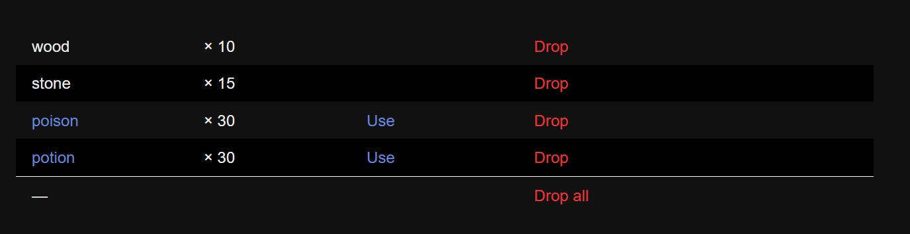
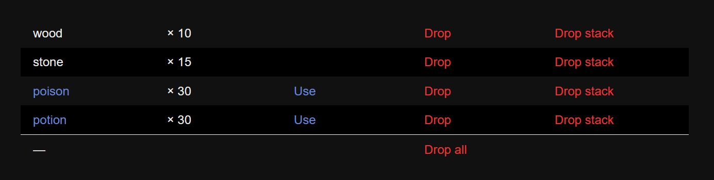
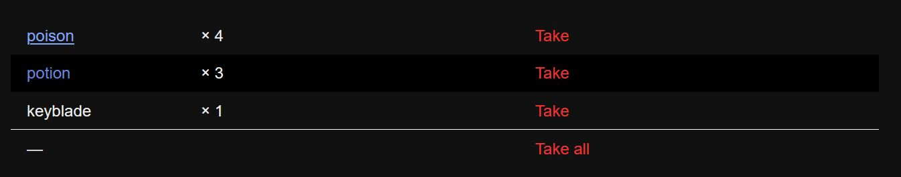
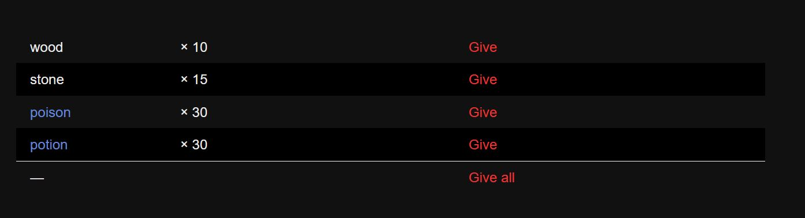

# Simple Inventory Guide

The simple inventory is designed to be robust but approachable. This guide will attempt to introduce you to the concepts and features of the system in a gentle, topical way, while the API documentation pages will instead cover everything *possible* that you can do with the system.

- [Creating an Inventory](#creating-an-inventory)
- [Adding and Removing Items](#adding-and-removing-items)
  - [Pick Up and Merge](#pick-up-and-merge)
  - [Drop and Unmerge](#drop-and-unmerge)
  - [Transfers](#transfers)
- [Checking and Testing an Inventory](#checking-and-testing-an-inventory)
  - [Checking for Items](#checking-for-items)
  - [Counting Items](#counting-items)
- [Player Interaction and Interfaces](#player-interaction-and-interfaces)
  - [Built-in Interfaces](#built-in-interfaces)
  - [Changing Default Strings](#changing-default-strings)
  - [Designing Your Own Interface](#designing-your-own-interface)
- [Item Definitions](#item-definitions)
  - [Item IDs and Names](#item-ids-and-names)
  - [Item Descriptions](#item-descriptions)
  - [Consumables and Using Items](#consumables-and-using-items)
  - [Unique and Permanent Items](#unique-and-permanent-items)
- [Inventories as Arrays and Objects](#inventories-as-arrays-and-objects)
- [Inventory Events](#inventory-events)

## Creating an Inventory

Before you can use an inventory or interact with it, you first need to **initialize** it. In much the same way you can initialize a variable, for example, setting a value to `0` before working with it, you need to set up a blank, empty inventory. The best place to do this, most of the time, is in your project's [`StoryInit` special passage](https://www.motoslave.net/sugarcube/2/docs/#special-passage-storyinit). You *can* set up inventories elsewhere in your game if that makes more sense to you, and in some cases, it certainly will.

There are two ways to create a new inventory:

```
<<newinv $backpack>>
<<set $backpack to Inventory.create()>>
```

The above are the same, the former uses the `<<newinv>>` macro while the latter uses the simple inventory's JavaScript API. There is no reason to use one method over the other, whichever you prefer is fine. The exception is if you want to assign an inventory instance to a variable that isn't a story variable (e.g., `$var`) or a temporary variable (e.g., `_var`).

```
<<newinv setup.backpack>> /* THIS WILL CAUSE AN ERROR! */
<<set setup.backpack to Inventory.create()>> /* this works fine! */
```

> [!NOTE]
> You don't have to quote variable names anymore anywhere in v3 of the simple inventory (you used to have to in v2). You may quote them if you want to, but it's no longer required!

Once you've set up the inventories you need, you can start adding items to them!

## Adding and Removing Items

Adding and removing items is probably the most important part of any inventory, and there are a few ways you can add and remove items to and from your inventories, or even between multiple inventories!

### Pick Up and Merge

To add an item or a set of items to an inventory, you pick them up. You can pick up many items at once using a single command. You must specify how many of each item to pick up.

```
<<pickup $backpack "wood" 10 "stone" 5>>
<<run $backpack.pickup("wood", 10, "stone", 5)>>
```

Both of the above would add 10 items with the ID `"wood"` and 5 items with the ID `"stone"` to the inventory in the `$backpack` variable. Note that **you must always specify the number of items to pick up, even if it's only one**.

```
<<pickup $backpack "key to the airship" 1>>
```

You can also place all of the items in one inventory in another inventory by *merging* the latter into the former. Merging does not remove items from the giving inventory, if you want to remove the items from one inventory and add them to another, see [transfers](#transfers) below.

```
<<newinv _loot>>
<<pickup _loot "golden statue" 1 "health potion" 3>>

<<merge $backpack _loot>>
/* --or-- */
<<run $backpack.merge(_loot)>>
```

The JavaScript version of the `merge()` method also allows you to give a list of items as a plain object:

```javascript
var items = {
    'gold statue' : 1,
    'health potion' : 3
};
State.variables.backpack.merge(items);
```

 This may be useful for more complicated games.

### Drop and Unmerge

To remove an item or a set of items to an inventory, you drop them. Much like with picking items up, you can drop many items at once using a single command. You must specify how many of each item to drop.

```
<<drop $backpack "wood" 10 "stone" 5>>
<<run $backpack.drop("wood", 10, "stone", 5)>>
```

Both of the above would remove 10 items with the ID `"wood"` and 5 items with the ID `"stone"` from the inventory in the `$backpack` variable. Note that **you must always specify the number of items to drop, even if it's only one**.

```
<<drop $backpack "key to the airship" 1>>
```

> [!TIP]
> If the inventory doesn't contain an item it's asked to drop, nothing happens. No errors will be thrown, and the items that are present in the command, if any, will be removed as normal. Please be careful as this may hide some bugs.

You can also remove all of the items in one inventory from another inventory by <em>**un**merging</em> the latter drom the former. Like merging, unmerging does not affect the giving inventory, if you want to remove the items from one inventory and add them to another, see [transfers](#transfers) below.

```
<<newinv _stolenItems>>
<<pickup _stolenItems "wallet" 1 "cellphone" 1>>

<<unmerge $backpack _stolenItems>>
/* --or-- */
<<run $backpack.unmerge(_stolenItems)>>
```

The JavaScript version of the `unmerge()` method also allows you to give a list of items as a plain object:

```javascript
var items = {
    wallet : 1,
    cellphone : 1
};
State.variables.backpack.unmerge(items);
```

 This may be useful for more complicated games.

In addition to dropping items, you can also quickly remove all items from an inventory with the `<<dropall>>` macro or the `empty()` method:

```
<<dropall $backpack>>
<<run $backpack.empty()>>
```

> [!TIP]
>
> **What if I want to remove all the instances of a single item?**
> If you find yourself wanting to remove all of one kind of item from the inventory, say, all `"health potion"` items, you can use the [JavaScript `Infinity` value](https://developer.mozilla.org/en-US/docs/Web/JavaScript/Reference/Global_Objects/Infinity)! For example: `<<drop $backpack 'health potion' Infinity>>`.

### Transfers

Transfers are like pickups and drops combined, but they have a few special rules. 

```
<<transfer $chest $backback 'wood' 10 'stone' 5>>
<<run $chest.transfer($backpack, 'wood', 10, 'stone', 5)>>
```

The process of a transfer works something like this:

1. The provided list of items are removed from the first inventory, similar to a drop command.
2. Only the items that are actually removed from the first inventory are added to the second, similar to a pickup command.

Since only items that are actually present in the first inventory will be moved to the second, some care may be required to avoid bugs and unintended issues. For example, if in the above code, `$chest` only contains 8 `'wood'` items, only 8 will ultimately be added to the `$backpack`, whereas if you used a drop command and then a pickup command, `$backpack` would always receive 10, no matter how many were in `$chest`.

> [!TIP]
>
> **How can I move all items from one inventory to another?**
> If you want to move all of the contents of one inventory to another, you can so by merging the inventories, then emptying the giving inventory. For example: `<<merge $backpack $chest>><<dropall $chest>>`.

## Checking and Testing an Inventory

Let's say the player has to collect a key to move on. How can you know when they have the key? You'll need to check (or test, if you prefer) the contents of the inventory in an `<<if>>` macro (or similar). There are two general ways you might want to check an inventory: checking for the presence of items, and checking for a certain quantity of items.

### Checking for Items

The most basic way to check an inventory is with the `has()` method:

```
<<if $backpack.has('key to the garage')>>
	[[You can enter the garage.|garage]]
<</if>>
```

If the inventory contains at least one the listed item, it will be considered `true`.

In some cases, you may want to check that the player has *any* or *all* of the items in a list:

```
<<if $backpack.hasAll('gas can', 'kindling', 'cigarette lighter')>>
	You can start a fire!
<</if>>

<<if $backpack.hasAny('rope', 'ladder', 'chain', 'bounce pad')>>
	You can escape the chasm!
<</if>>
```

The `hasAll()` method returns `true` if the inventory has at least one of **all** of the listed items, while the `hasAny()` method returns `true` if the inventory contains at least one of **any** of the listed items.

In addition to the above, you can also use the `compare()` method to check if an inventory contains all of the items present in another inventory:

```
<<newinv _requiredItems>>
<<pickup _requiredItems "eye of newt" 1 "quart of pig's blood" 4 "ounce of fairy dust" 2>>
<<if $backpack.compare(_requireItems)>>
	You have the necessary items to make the potion!
<</if>>
```

The JavaScript version of the `compare()` method also allows you to give a list of items as a plain object:

```javascript
var items = {
    "eye of newt" : 1,
    "quart of pig's blood" : 4,
    "ounve of fairy dust": 2
};
if (State.variables.backpack.compare(items)) {
    // do something
}
```

 This may be useful for more complicated games.

### Counting Items

If you need to know how many of a given item the player has, you can use the `has()` and `count()` methods. For example:

```
<<if $backpack.has('keycards', 3)>>
	You have all three keycards!
<</if>>

<<if $backpack.count('keycards') >= 3>>
	You have all three keycards!
<</if>>
```

The `count()` method returns the number of the specified item in the inventory, while `has()` lets you specify a number of items when checking how many are present in the inventory. If the second argument isn't provided to `has()`, it's assumed to be `1`, as illustrated in the preceding section.

You may also want to know how many items are in the inventory overall. You can look at the inventory's `length` and `uniqueLength` properties for that.

```
<<newinv $box>>
<<pickup $box 'wood' 2 'stone' 5 'iron' 8>>

<<= $box.length>> /* 15 */
<<= $box.uniqueLength>> /* 3 */
```

The inventory's `length` is how many items, in total, are in the inventory, including all duplicates/stacks. The `uniqueLength` property is how many unique items (meaning they have different IDs and don't stack) are in the inventory.

> [!WARNING]
> Trying to set `length` or `uniqueLength` will result in an error.

## Player Interaction and Interfaces

The simple inventory includes a few UI components for interacting with and managing inventories in games. With the included tools you can have players view an inventory and use or drop items from them, or transfer items between inventories. The macros are a bit complicated, so bear with me.

You may also want to create your own interfaces, which can be done pretty easily with a `<<for>>` macro or similar.

### Built-in Interfaces

The built-in UI comes in a few different types. To show the most basic inventory, with no interactive elements, use the `<<inv>>` command, with no additional arguments, just the inventory you wish to show:

```
<<inv $backpack>>
```

The result may look like this:


Say you want the player to be able to freely use and drop the items in the inventory, then you'd add some **flags** to the macro:

```
<<inv $backpack use drop>>
```


Want to add an option to drop all items? And how about a way to inspect the items, showing their [descriptions](#item-descriptions)?

```
<<inv $backpack use drop inspect all>>
```



You may also provide the flag`stack` to allow players to drop/transfer entire stacks of items all at once:

```
<<inv $backpack use drop inspect stack all>> 
```



There are also two main variations of the `<<inv>>` macro, `<<give>>` and `<<take>>`. Each of these macros require you to specify an inventory to receive the dropped items from the inventory being displayed. The `Drop` wording will be changed to `Give` or `Take` depending on the macro as well. For example, let's say a player opens a treasure chest, you could show the chest's contents with the `<<take>>` macro and allow them to freely pick up the contents, adding anything taken to the `$backpack` inventory.

 ```
<<take $chest $backpack inspect all>>
 ```



Likewise, you may want to allow players to give away or store items in other inventories, in which case the verbs "Take" and "Drop" make less sense than "Give":

```
<<give $backpack $storage inspect all>>
```



These default interfaces can get you started, and may even be sufficient for some games.

> [!TIP]
> The basic styling on these UI components are intended to fit with a wide variety of games and to fit it as part of the basic, unchanged SugarCube UI as well. You can keep them as is, but they're actually just a `<ul>` with a `<li>` for each item, so should be easy to style how you want if you don't like how they look!

### Changing Default Strings

You can change the default strings used by the built-in interfaces, for example, `Give`, `Use`, etc, to be whatever you want using either the `inventory.strings` special passage, or by using the `Inventory.strings` and `Inventory.emptyMessage` properties of the [Inventory API](InventoryAPI.md).

The strings that can be changed in the special passage are as follows:

- `inspect`: **not used** in the default interface, since the user clicks on the names of items to see their descriptions, however, a link for inspecting items may be needed in the future or by users. Default: `"Inspect"`
- `drop`: appears as link text when users can drop items in the interface. Default: `"Drop"`
- `take`: can appear as link text when users can transfer items in the interface. Default: `"Take"`
- `give`: can appear as link text when users can transfer items in the interface. Default: `"Give"`
- `use`: link text for the action allowing consumables to be used. Default: `"Use"`
- `stack`: the text used to refer to an item stack when dropping or transferring whole stacks in the default interface. Default: `"stack"`
- `stackPre`: string appears before the item stack counts. Default: `"&nbsp;&times;&nbsp;"` (that is,&nbsp;&times;&nbsp;)
- `stackPost`: string appears after the item stack counts. Default: `"&nbsp;"`
- `empty`: this string appears when an empty inventory is displayed. In the API, this is handled by a separate property, `Inventory.emptyMessage`, passing this value to `Inventory.strings` won't have any effect! Default: `"&hellip;"`

For example, an `inventory.strings` special passage may look like this:

```
:: inventory.strings
use: "Activate"
take: "Swipe"
empty: "The inventory is empty!"
```

To do the same thing with the API, the JavaScript code would look like this:

```javascript
Inventory.strings = { use : "Activate", take : "Swipe" };
Inventory.emptyMessage = "The inventory is empty!";
```

Note that you only need to provide values for the strings you want to change; the rest will fall back to the defaults. Also, if you decide to create your own interface, you likely won't need to change these at all.

### Designing Your Own Interface

You don't need to stick to the default interfaces provided, and using a `<<for>>` macro or similar, you could easily make you own variants. You can get an object containing the inventory's item/amount pairs using the `table` property.

```
<<nobr>>
	<<for _item, _amount range $backpack.table>>
		<div class='item-listing'>_item (_amount)</div>
	<</for>>
<</nobr>>
```

In the future, I'll have some recipes in these docs, and I hope to have more detailed examples of things like shops and alternative inventory UIs. For now, though, this should be enough to get you started if you're interested.

## Item Definitions

New in v3 of the simple inventory are item definitions. If you want, you can define items to give them some additional properties. You don't have to use items definitions, as simply having items represented as strings, like in v2, works fine. But having definitions allows you to associate items with some code to "use" them, give them definitions, or even give them some special properties.

> [!DANGER]
> All items **must be** defined in your [`StoryInit` special passage](http://www.motoslave.net/sugarcube/2/docs/#special-passage-storyinit)! No exceptions! The macro won't even work outside `StoryInit`.

Item definitions might look like this:

```
<<item "key_1" "Crypt Key">>
<<description>>\
	An old, rusty key with a skull shape on it. Spoooooky.\
<<unique>>
<</item>>

<<consumable "health potion">>
	<<set $hp to Math.clamp($hp + 20, 0, 100)>>
<<description>>\
	<<include "health potion description">>\
<</consumable>>

<<item "Cursed Tatoo">>
<<description>>\ 
	<<nobr>>
		<<if $knows>>
			The player is branded by the ancient cursed tatoo!
		<<else>>
			...
		<</if>>
	<</nobr>>\
<<permanent>>
<</item>>
```

The `<<item>>` macro is for making non-usable items, while the `<<consumable>>` macro creates items that can be consumed to use them, like potions.

Both macros have the same children, `<<description>>` for setting an item description, which will be displayed in a dialog, and the children `<<permanent>>`, `<<unique>>`, and `<<tags>>` for metadata.

### Item IDs and Names

An item must have an ID, and can optionally have a name. An ID is used internally to refer to the item. In the first example above, the item has the ID `key_1` and the name `Crypt Key`. When you pass the item around, you always use the ID, e.g., `<<pickup $backpack "key_1" 1>>`. When displayed, such as by the `<<inv>>` macro, however, the item will appear as `Crypt Key` to players.

If a name is not given, the ID is used as the name. Likewise, items without definitions don't have names and must always be referred to and displayed by their IDs.

All rows of the default user-interface components expose the ID via the `data-item-id` HTML attribute.

### Item Descriptions

Item descriptions can contain any amount of code, and are displayed in dialog boxes when the item is inspected. If the `inspect` flag is passed to the `<<inv>>` macro (or similar), players can inspect items by clicking on their names.

The `<<description>>` child tag starts the item's description, as it goes until the next child tag is encountered.

### Consumables and Using Items

Any code immediately after the `<<consumable>>` macro is opened, before the first child tag, is run whenever the consumable is used. The second example above, the health potion, shows this off.

Consumables can be used from the `<<inv>>` interface, but you can also use an item from an inventory with the `use()` method:

```
<<run $backpack.use('health potion')>>
```

If the player has the item it will be used and one will be dropped, as normal. If the player doesn't have the item, **it will still be used**, so be careful! If you were to create something like a health potion option outside the inventory interface, you'd probably want to [check that the player has one](#checking-for-items) before letting them use it.

```
<<if $backpack.has('health potion')>>
	<<button 'Use a health potion!'>>
		<<run $backpack.use('health potion')>>
	<</button>>
<<else>>
	No health potions...
<</if>>
```

In the default user-interface components, all tallycounts wich represent more than one unit of the same item have the `.item-count.multi` CSS classes, otherwise `.item-count.single` to signify that there is only one unit left.

### Unique and Permanent Items

The `<<unique>>` and `<<permanent>>` child tags designate items as *unique* or *permanent*, as you may expect.

- **Unique** items are items any given inventory may only ever have a single instance of. These items may exist in multiple inventories, however. If an inventory would get an additional one of these, this addition will silently fail. In the case of transfers, the giving inventory will still lose the item, so be careful!
- **Permanent** items are items that, once in an inventory, cannot be removed. Attempts to drop or transfer the item out of the inventory will silently fail.

Generally speaking, these properties help prevent issues in your code, but aren't intended to enforce every part of your game to comply with the way these items are designated. Some care is still required in some cases, such as to make sure items that need to only ever exist in a single location are truly unique across the entire game.

That said, for the vast majority of use cases, simply setting these properties on a given item is probably close enough.

## Inventories as Arrays and Objects

It can be useful to get the data present in an inventory as an array or object. As covered briefly earlier, getting an object of item/amount pairs is as simple as accessing the `table` property of an inventory instance.

```
<<set _object to $backpack.table>>
```

Caution is necessary as changes to this object **will** be reflected in the inventory!

You can also get the inventory's content as an array by using either the `array` or `list` properties. The former includes all the items in the inventory as individual entries, while the latter only includes unique items.

```
<<newinv _example>>
<<pickup _example "gem" 3 "pearl" 1>>

<<= _example.list>> /* => ['gem', 'pearl'] */
<<= _example.array>> /* => ['gem', 'gem', 'gem', 'pearl'] */
```

There is also an `iterate()` method which can be used similar to how you might use a `forEach()` method:

```javascript
State.temporary.example.iterate( function (item, amount) {
    console.log('item', 'amount');
}); // => gem 3, pearl 1
```

## Inventory Events

Returning, but in a new form, from v2 are events. There are two main types of events, and an API has been added specifically for user events.

```javascript
Inventory.events.update.on( function (ev) {
	console.log(ev.delta);
});

Inventory.events.use.on( function (ev) {
    if (ev.item.id === 'health potion') {
        console.log('used a health potion...');
    }
});
```

Events are a bit complex to get into too deeply in this brief guide, but you can refer to the API for more info.  You can plug into inventory updates (any time an inventory changes in some way, with delta objects showing what's been added/removed), or item uses, which allow you to plug into item usages.

It is not recommended you interact with these events without going through the provided API as some parts of the library listen for certain events for its own functionality, and the APIs sandbox user event handlers away from the libraries handlers.
