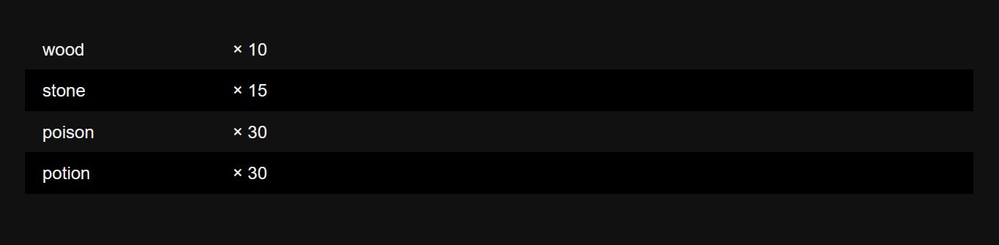
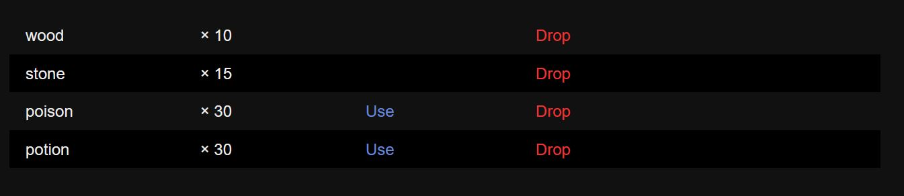

# Macros

The simple inventory system adds the following macros.

### Macro: `<<newinv>>`

The `<<newinv>>` macro creates and initializes a SugarCube story variable (e.g., `$var`) or temporary variable (e.g., `_var`) as an empty inventory.

> [!WARNING]
> You must initialize a variable as an inventory before doing anything else inventory-related with it.

> [!TIP]
> The [`StoryInit` special passage](http://www.motoslave.net/sugarcube/2/docs/#special-passage-storyinit) is typically the best place to initialize variables, including new inventories, though you can do so anywhere.

#### Syntax

```
<<newinv variable [tags]>>
```

#### Arguments

- `variable` the name of a story or temporary variable, which must start with a `$` or a `_` and otherwise follow all the [normal rules for variable names imposed by SugarCube](http://www.motoslave.net/sugarcube/2/docs/#twinescript-variables).
- `tags` (optional) a list of tags, separated by spaces. Tags are not used by the simple inventory, but are provided to authors as a means of providing metadata to inventory instances.

> [!NOTE]
> In v2 of the simple inventory, you had to wrap variable names in quotes to pass them in. This is no longer required.

#### Example

```
<<newinv $backpack>>

/* example with tags: adds the tags "contianer" and "loot" */
<<newinv _chest "container" "loot">>
```

### Macro: `<<pickup>>`

The `<<pickup>>` macro can be used to add items to an existing inventory instance, identified by its variable.

#### Syntax

```
<<pickup inventory item num [item num ...]>>
```

#### Arguments

- `inventory` the name of a story or temporary variable that holds an existing inventory instance.
- `item` and `num` are pairs of items and numbers of items to add to the inventory. You may pass in any number of these pairs, but all pairs must be complete. Even if you only want to add one of the item, you must specify `1`.

#### Example

```
<<pickup $backpack "wood" 10 "stone" 5>>
<<pickup $backpack "key to the airship" 1>>
```

### Macro: `<<drop>>`

The `<<drop>>` macro can be used to remove items from an existing inventory instance, identified by its variable.

#### Syntax

```
<<drop inventory item num [item num ...]>>
```

#### Arguments

- `inventory` the name of a story or temporary variable that holds an existing inventory instance.
- `item` and `num` are pairs of items and numbers of items to remove from the inventory. You may pass in any number of these pairs, but all pairs must be complete. Even if you only want to remove one, you must specify `1`.

> [!TIP]
> To remove all the instances of a given item from an inventory, you can pair it with the value `Infinity`, like so: `<<drop $backpack 'gem' Infinity>>`.

> [!WARNING]
> If you attempt to remove an item or items that aren't present in the inventory, nothing happens and no errors or warnings will be displayed.

#### Example

```
<<drop $backpack "wood" 10 "stone" 5>>
<<drop $backpack "key to the airship" 1>>
```

### Macro: `<<merge>>`

The `<<merge>>` macro adds all the items from the second inventory into the first inventory. **This macro causes no changes to the second inventory.**

#### Syntax

```
<<merge inventory anotherInventory>>
```

#### Arguments

- `inventory` the name of a story or temporary variable that holds an existing inventory instance.
- `anotherInventory` the items in this inventory are copied over to the other inventory.

#### Example

```
<<merge $backpack $chest>>
```

### Macro: `<<unmerge>>`

The `<<unmerge>>` macro removes all the items present in the second inventory from the first inventory. **This macro causes no changes to the second inventory.**

#### Syntax

```
<<unmerge inventory anotherInventory>>
```

#### Arguments

- `inventory` the name of a story or temporary variable that holds an existing inventory instance.
- `anotherInventory` if any of the items in this inventory are present in the first inventory,they are removed from the first inventory.

> [!WARNING]
> If you attempt to remove an item or items that aren't present in the inventory, nothing happens and no errors or warnings will be displayed.

#### Example

```
<<unmerge $backpack $chest>>
```

### Macro: `<<dropall>>`

The `<<dropall>>` macro removes all the items from an inventory, emptying it.

#### Syntax

```
<<dropall inventory>>
```

#### Arguments

- `inventory` the name of a story or temporary variable that holds an existing inventory instance.

> [!WARNING]
> If the inventory is already empty, nothing will happen and no errors or warnings will be displayed.

#### Example

```
<<dropall $backpack>>

/* tansfer all items from one inventory to another without needing to specify them: */
<<merge $backpack $chest>>
<<dropall $chest>>
```

### Macro: `<<transfer>>`

The `<<transfer>>` takes items from one inventory and adds them to another inventory. If an item to be transferred is not present in the giving inventory, it **will not** be added to the receiving inventory!

#### Syntax

```
<<transfer inventory targetInventory item num [item num ...]>>
```

#### Arguments

- `inventory` the name of a story or temporary variable that holds an existing inventory instance. This is the inventory **giving** the items.
- `targetInventory` this is the inventory that should **receive** the items.
- `item` and `num` are pairs of items and numbers of items to remove from the inventory. You may pass in any number of these pairs, but all pairs must be complete. Even if you only want to remove one, you must specify `1`.

> [!TIP]
> To transfer all the instances of a given item, you can pair it with the value `Infinity`, like so: `<<transfer $chest $backpack 'gem' Infinity>>`.

#### Example

```
<<transfer $backpack $storage "wood" 10 "stone" 5>>
<<transfer _chest $backpack "gem" 1>>
```

### Macros: `<<inv>>`, `<<take>>`, and `<<give>>`

These macros can be used to show the default user-interface components for managing inventories. `<<inv>>` shows an interface where items cannot be transferred at all, only dropped, and is ideal for showing the user their own inventory. `<<take>>` and `<<give>>` show an interface where items can be transferred to a different inventory, with the associated verb: `<<take>>`  is intended for containers the player can loot, `<<give>>` is intended for containers the player can place items in. You make want to show both on the same page to let the player do both.

#### Syntax

```
<<inv inventory [flags]>>
<<take inventory targetInventory [flags]>>
<<give inventory targetInventory [flags]>>
```

#### Arguments

- `inventory` the name of a story or temporary variable that holds an existing inventory instance. This is the **giving** inventory in transfers.
- `targetInventory` this is the inventory that should **receive** the items in transfers.
- `flags` (optional) includes flags determine which links should be shown for the inventory:
  - `drop` shows the `Drop` option allowing users to drop items (discarding them). This option only works in the `<<inv>>` variant of the macro.
  - `inspect` allows items to be "inspected," meaning users can click the item's name to see its description in a dialog box, if it has a description. Refer to the `<<item>>` macro below.
  - `use` allows the player to "use" an item if it is considered a consumable, and using it will expend one of the items and cause it's use code, if any, to be run. Refer to the `<<item>>` macro below.
  - `all` shows a "Drop/Give/Take all," button at the bottom of the inventory list. 

#### Examples

```
<<inv $backpack>>
```



```
<<inv $backpack use drop>>
```



```
<<inv $backpack use drop inspect all>>
```


 ```
<<take $chest $backpack inspect all>>
 ```


```
<<give $backpack $storage inspect all>>
```


### Macros: `<<item>>` and `<<consumable>>`

These macros allow you to create item definitions. You do not need to define items unless you want to give items extra features and functionality. All items **must be** defined in your [`StoryInit` special passage](http://www.motoslave.net/sugarcube/2/docs/#special-passage-storyinit)! No exceptions! The macro won't even work outside `StoryInit`.

Items feature optional child tags that can be included to designate them as having certain special properties or to provide additional item data. They can be a bit complicated to set up, so please read this section carefully and [refer to the guide](Guide.md#item-definitions) for more details.

#### Syntax

```
<<item ID [name]>>[optional child tags]<</item>>
<<consumable ID [name]>>[Usage code][optional child tags]<</consumable>>
```

#### Arguments

- `ID` the item ID, which is used to refer to the item internally in your code.
- `name` (optional) will override the ID and be displayed to the player if provided.

#### Optional Child Tags

```
<<description>>[description code and content]
<<unique>>
<<permanent>>
<<tags [list of tags]>>
```

- `<<desription>>` everything between this tag and the next child tag will be considered a description, and any code or content will be executed and rendered in a dialog box when the item is inspected.
- `<<unique>>` designates an item as **unique**. Unique items are items any given inventory may only ever have a single instance of. These items may exist in multiple inventories, however. If an inventory would get an additional one of these, this addition will silently fail. In the case of transfers, the giving inventory will still lose the item, so be careful!
- `<<permanent>>` designates an item as **permanent**. Permanent items are items that, once in an inventory, cannot be removed. Attempts to drop or transfer the item out of the inventory will silently fail.
- `<<tags>>` like with inventories, users may supply tags to items as metadata.

#### Examples

```
<<item "key_1" "Crypt Key">>
<<description>>\
	An old, rusty key with a skull shape on it. Spoooooky.\
<<unique>>
<</item>>

<<consumable "health potion">>
	<<set $hp to Math.clamp($hp + 20, 0, 100)>>
<<description>>\
	<<include "health potion description">>\
<</consumable>>

<<item "Cursed Tatoo">>
<<description>>\ 
	<<nobr>>
		<<if $knows>>
			The player is branded by the ancient cursed tatoo!
		<<else>>
			...
		<</if>>
	<</nobr>>\
<<permanent>>
<</item>>
```

